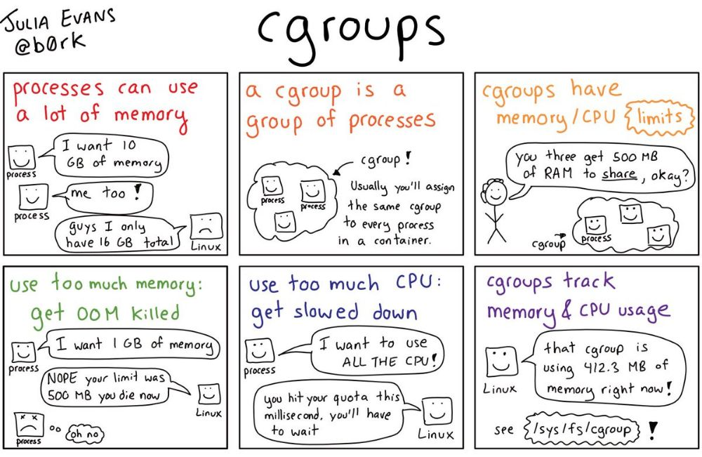

<div dir="rtl">

در این نوشتار در دو قسمت به بررسی فضانام‌ها در لینوکس و جزئیات ایزوله کردن پردازه پرداخته‌ایم. آشنایی با این جزئیات کمک می‌کند که درک درست‌تری از کانتینری کردن یک پردازه توسط تکنولوژی‌هایی مثل داکر داشته باشیم. در قسمت [اول](/p/فضانامها-در-لینوکس-۱/) این نوشتار فضانام‌های uts، pid، mount و network را مورد بررسی قرار دادیم. در این قسمت به بررسی فضانام‌های user، ipc، cgroup و time می‌پردازیم.


## فضانام کاربر (user)

این فضا‌نام به پردازه‌ها اجازه می‌دهد که User ID و Group ID جدا از میزبان داشته باشند. مهم‌ترین مزیتی که این سطح از ایزوله کردن فراهم می‌کند این است که در داخل کانتینر می‌توان کاربر یک root داشت که خارج از کانتینر یک کاربر غیر root باشد. یکی از چالش‌های امنیتی کانتینرها دور زدن مکانیزم‌های امنیتی (مثلا container escape) و دسترسی به میزبان است. از منظر امنیت این یک ویژگی کلیدی است که اجازه می‌دهد پردازه‌ی داخل کانتینر که وابسته به کاربر root است اجرا شود ولی حتی اگر به نحوی پردازه‌ بتواند از محیط ایزوله خارج شود سطح دسترسی آن در میزبان کم‌تر از کاربر root می‌باشد.

برای آزمایش این ویژگی دستورات زیر را اجرا می‌کنیم.

```bash
$ unshare --user bash
nobody@Milad-PC:/tmp$ id
uid=65534(nobody) gid=65534(nogroup) groups=65534(nogroup)
nobody@Milad-PC:/tmp$ capsh --print | grep Current
Current: =
```

همان‌طور که می‌بینیم در فضانام user که ساختیم کاربر دارای شناسه‌ی nobody است و همین‌طور هیچ capability نیز به آن تخصیص نیافته است.

برای ادامه‌ی کار به pid پردازه‌ی bash در این فضانام نیاز داریم. در اینجا باید یک نگاشت بین شناسه‌ی کاربر در داخل فضانام و داخل میزبان ایجاد کنیم. این نگاشت باید در فایل proc/<pid>/uid_map/ اعمال شود. برای اینکه بدانیم چه مقادیری وارد شود نیاز است که ساختار آن را بدانیم.

```bash
nobody@Milad-PC:/tmp$ echo $$
27391
```
توضیح:

```bash
$ man user_namespaces
...
Each line in the uid_map file specifies a 1-to-1 mapping of a range of contiguous user IDs between two user namespaces. (When a
user namespace is first created, this file is empty.) The specification in each line takes the form of three numbers delimited
by white space. The first two numbers specify the starting user ID in each of the two user namespaces. The third number speci‐
fies the length of the mapped range. 
...
```
با توجه به توضیحات موجود در راهنمای user_namespaces در این فایل باید سه مقدار معین شود. مقدار اول مشخص کننده‌ی شناسه‌ی کاربر در فضانام ایجاد شده می‌باشد. مقدار دوم مشخص کننده‌ی شناسه‌ی کاربر در میزبان می‌باشد و سومین مقدار تعداد شناسه‌ها برای نگاشت را مشخص می‌کند. به طور خلاصه:

<div dir=ltr>

`UID-inside-namespace UID-outside-namespace length`

</div>

برای مثال اگر بخواهیم کاربر milad را به کاربر root در داخل فضانام بایند کنیم باید به ترتیب مقادیر 1000 (شناسه‌ی کاربر milad در میزبان)، 0 (شناسه‌ی کاربر root در فضانام) و 1 (فقط یک نگاشت می‌خواهیم انجام بدیم).


```bash
$ id
uid=1000(milad) gid=1000(milad) groups=1000(milad),27(sudo),104(input)

$ sudo echo '0 1000 1' > /proc/31196/uid_map
```

مشابه همین نگاشت برای شناسه‌ی گروه (gid) نیز انجام می‌شود.

```bash
$ sudo echo '0 1000 1' > /proc/27391/gid_map
```

سپس مجددا در ترمینال ایجاد شده در فضانام دستور id را اجرا می‌کنیم.

```bash
nobody@Milad-PC:/tmp$ id
uid=0(root) gid=0(root) groups=0(root),65534(nogroup)
nobody@Milad-PC:/tmp$ cat /proc/self/uid_map
0       1000          1
nobody@Milad-PC:/tmp$ cat /proc/self/gid_map
0       1000          1
nobody@Milad-PC:/tmp$ capsh --print | grep Current
Current: = cap_chown,cap_dac_override,cap_dac_read_search,cap_fowner,cap_fsetid,cap_kill,cap_setgid,cap_setuid,cap_setpcap,cap_linux_immutable,cap_net_bind_service,cap_net_broadcast,cap_net_admin,cap_net_raw,cap_ipc_lock,cap_ipc_owner,cap_sys_module,cap_sys_rawio,cap_sys_chroot,cap_sys_ptrace,cap_sys_pacct,cap_sys_admin,cap_sys_boot,cap_sys_nice,cap_sys_resource,cap_sys_time,cap_sys_tty_config,cap_mknod,cap_lease,cap_audit_write,cap_audit_control,cap_setfcap,cap_mac_override,cap_mac_admin,cap_syslog,cap_wake_alarm,cap_block_suspend,cap_audit_read+ep
```

با توجه به خروجی بالا مشاهده می‌شود که کاربر در داخل فضانام root است و به capabilityها دسترسی دارد و در خارج از فضانام همان ‌کاربر milad با شناسه کاربری 1000 می‌باشد.


## فضانام ارتباط بین پردازه‌ای(IPC)

در سیستم‌عامل لینوکس دو پردازه‌ می‌توانند از طریق حافظه‌ی مشترک یا صف پیام مشترک ([mq_open]https://man7.org/linux/man-pages/man3/mq_open.3.html)) با یکدیگر پیام تبادل کنند. برای اینکار این دو پردازه باید عضو یک فضا‌نام IPC یکسان باشند. از طرفی به طور پیش‌فرض ما انتظار داریم که پردازه‌های موجود در کانتینرهای مختلف نتوانند به حافظه‌ی مشترک یکدیگر دسترسی داشته باشند برای همین برای آن‌ها فضانام‌های IPC مجزا ایجاد می‌کنیم.

برای نمونه می‌بینیم که به صورت پیش‌فرض کانتینرها در داکر دارای فضانام ipc اختصاصی هستند:

```bash
$ docker ps --quiet --all | xargs docker inspect --format '{{ .Id }}: IpcMode={{ .HostConfig.IpcMode }}'                        

037ad3a550a7de78ac9a929159b627e765cf753a314f9f4c7f564127b7ac9ccb: IpcMode=private
8676c058096d7337cd497457da25a596f2cc6f317b01d033b2c53329fc6e2619: IpcMode=private
d1704e1cb4f280d5e5afeabb8064526fc09f297183006086354fe443c5359b42: IpcMode=private
```

برای آزمایش فضانام ipc ابتدا یک حافظه‌ی مشترک ایجاد می‌کنیم سپس با دستور ipcs فهرست ipcهای موجود را بررسی می‌کنیم:

```bash
$ ipcmk -M 1000
Shared memory id: 2044428296
$ ipcs
------ Message Queues --------
key        msqid      owner      perms      used-bytes   messages    
------ Shared Memory Segments --------
key        shmid      owner      perms      bytes      nattch     status      
0x00000000 2033451008 milad      600        524288     2          dest 
...      
0xaac7b1b4 2044428296 milad      644        1000       0                       
...
0x00000000 849346606  milad      600        524288     2          dest         
------ Semaphore Arrays --------
key        semid      owner      perms      nsems     
0xe93c17d9 131072     milad      666        1         
0xcdbd64db 163841     milad      600        1
```

سپس با استفاده از unshare یک فضانام ipc ایجاد می‌کنیم و با دستور ipcs فهرست ipcها را بررسی می‌کنیم.

```bash
$ sudo unshare --ipc /bin/bash                                                                                          root@Milad-PC:~# ipcs
------ Message Queues --------
key        msqid      owner      perms      used-bytes   messages    
------ Shared Memory Segments --------
key        shmid      owner      perms      bytes      nattch     status      
------ Semaphore Arrays --------
key        semid      owner      perms      nsems
```
همان‌طور که مشاهده می‌کنیم پردازه‌ی موجود در داخل فضانام جدید به فهرست ipcهای موجود در میزبان دسترسی ندارد. 

## فضانام cgroup

در سیستم‌عامل منابعی مانند پردازنده (CPU)، حافظه‌ی اصلی (RAM)، پهنای‌باند شبکه و ... به صورت مشترک بین پردازه‌ها استفاده می‌شود. در این شرایط یک پردازه می‌تواند به صورت ناعادلانه بخش زیادی از این منابع را تصرف نماید. برای محدود کردن میزان مصرف این منابع توسط پردازه‌ها در سیستم‌عامل لینوکس قابلیتی به نام control groups یا به اختصار cgroups وجود دارد. با بهره‌برداری از cgroups مدیر سیستم می‌تواند به صورت دقیق و بهینه بر روی تخصیص و محدود کردن (Resource limiting)، اولویت‌بندی (Prioritization)، مدیریت (Control) و حسابرسی (Accounting) منابع (زیر سیستم‌ها) کنترل داشته باشد.

تنظیمات cgroupها در قالب یک فایل سیستم مجازی و به صورت سلسله مراتبی نگه‌داری می‌شود. این ساختار مشابه اطلاع پردازه‌ها در مسیر proc/ می‌باشد. در این ساختار سلسله‌ مراتبی می‌توان cgroup‌های متعددی تعریف کرد که هر کدام از آن‌ها می‌تواند اطلاعاتی را از پدرش به ارث ببرد. همین‌طور هر کدام از cgroupها می‌تواند برای محدود کردن یک یا چند منابع (RAM, CPU, ...) تعریف شده باشند.



در لینوکس ۱۲ نوع کنترلر (زیرسیستم) برای cgroup وجود دارد که جزئیات دقیق آن‌ها را می‌توانید در [اینجا](https://man7.org/linux/man-pages/man7/cgroups.7.html) مطالعه کنید. با استفاده از دستور زیر می‌توانید فهرست آن‌ها را مشاهده کنید:

```bash
$ cat /proc/cgroups                                                                                                            #subsys_name	hierarchy	num_cgroups	enabled
cpuset	9	2	1
cpu	10	94	1
cpuacct	10	94	1
blkio	3	94	1
memory	4	132	1
devices	12	95	1
freezer	5	2	1
net_cls	8	2	1
perf_event	7	2	1
net_prio	8	2	1
hugetlb	11	2	1
pids	2	102	1
rdma	6	1	1
```

وقتی شما از یک تکنولوژی کانتینری استفاده می‌کنید به صورت خودکار عملیات لازم و مرتبط با تنظیمات شما اجرا خواهد شد. برای مثال در داکر با استفاده از دستور زیر یک کانتینر ایجاد کنید:

```bash
$ docker run -d --cpus=&quot1.0&quot --memory=&quot1g&quot hub.hamdocker.ir/library/alpine sleep 6000                                           bdd23fa5e49a88476f711a75e55a4ad5bd0d52fb3469a4c9d75b3f1e40a84cd1
```

سپس با استفاده از شناسه‌ی (ID) کانتینر ایجاد شده در داخل مسیر مربوط به cgroupها در داخل سیستم میزبان شناسه‌ی پردازه‌‌های مربوط به این cgroup را مشاهده می‌کنیم. مقدار pid درج شده در این فایل مربوط به پردازه‌ی sleep اجرا شده در داخل کانتینر است. 

```bash
$ cat /sys/fs/cgroup/devices/docker/bdd23fa5e49a88476f711a75e55a4ad5bd0d52fb3469a4c9d75b3f1e40a84cd1/tasks
29881
```

با بررسی پردازه‌ها از طریق سیستم میزبان صحت این موضوع را بررسی می‌کنیم.

```bash
$ ps -eaf | grep 29881                                                                                                       
root     29881 29849  0 02:07 ?        00:00:00 sleep 6000
milad    29954  7914  0 02:08 pts/1    00:00:00 grep --color=auto --exclude-dir=.bzr --exclude-dir=CVS --exclude-dir=.git --exclude-dir=.hg --exclude-dir=.svn 29881
```

فضانام cgroup برای جلوگیری از دسترسی پردازه‌ها به تنظیمات cgroup یکدیگر می‌باشد. هر پردازه در فضانام cgroup مسیر ریشه‌ی مختص به خود را خواهد داشت. این جداسازی هم از منظر امنیت جهت جلوگیری از نشت اطلاعات میزبان و هم از منظر صحت عملکرد به دلیل وجود قابلیت ارث‌بری و عدم تصادم نام‌ها مهم است.

برای بررسی قابلیت فضانام cgroup، یک فضانام از این نوع ایجاد می‌کنیم سپس محتویات فایل /proc/self/cgroup را در داخل فضانام و داخل ماشین میزبان بررسی می‌کنیم.

در داخل میزبان: 

```bash
$ cat /proc/self/cgroup                                                                                                   
12:devices:/user.slice
11:hugetlb:/
10:cpu,cpuacct:/user.slice
9:cpuset:/
8:net_cls,net_prio:/
7:perf_event:/
6:rdma:/
5:freezer:/
4:memory:/user.slice
3:blkio:/user.slice
2:pids:/user.slice/user-1000.slice/session-2.scope
1:name=systemd:/user.slice/user-1000.slice/session-2.scope0::/user.slice/user-1000.slice/session-2.scope
```
در داخل فضانام:

```bash
$ sudo unshare --cgroup /bin/bash                                                                                              root@Milad-PC:/proc/7914# cat /proc/self/cgroup
12:devices:/
11:hugetlb:/
10:cpu,cpuacct:/
9:cpuset:/
8:net_cls,net_prio:/
7:perf_event:/
6:rdma:/
5:freezer:/
4:memory:/
3:blkio:/
2:pids:/
1:name=systemd:/
0::/
```
همان‌طور که مشاهده می‌کنیم محتویات این دو فایل متفاوت است.

## فضانام time

یکی دیگر از فضانام‌ها در لینوکس که اخیرا در کرنل نسخه‌ی ۵.۶ اضافه شده است فضانام زمان یا time است. با استفاده از این فضانام پردازه‌ها می‌توانند مقادیر دلخواهی برای CLOCK_MONOTONIC و CLOCK_BOOTTIME داشته باشد. بنابراین زمان جاری و مقدار uptime میزبان می‌تواند با پردازه‌ی داخل این فضانام متفاوت باشد. داکر و تکنولوژی‌های مشابه آن فعلا از این ویژگی در زمان ایجاد کانتینر استفاده نمی‌کنند.

برای مثال با استفاده از دستور زیر می‌توانید یک کانتینر ایجاد کنید و مقدار uptime را در داخل کانیتنر و میزبان مقایسه کنید.

در داخل کانتینر:

```bash
$ docker run --rm -it hub.hamdocker.ir/library/alpine sh                                                                        
/ # uptime
 23:03:49 up 1 day, 13:16,  load average: 1.11, 0.74, 0.63
 ```

 در داخل میزبان:
 ```bash
 $ uptime                                                                                                                       
02:34:01 up 1 day, 13:17,  4 users,  load average: 1.02, 0.74, 0.64
```
این تفاوت ساعت در داخل کانتینر و میزبان به علت تفاوت timezone می‌باشد.

## جمع‌بندی

بعد از آشنایی با فضانام‌ها در لینوکس و cgroups حالا درک درست‌تری از کانتینر‌ها یا کانتینری کردن یک پردازه داریم. الان می‌دانیم که در داخل یک کانتینر یک پردازه‌ در حال اجرا است که توسط فضانام‌ها ایزوله شده و آستانه‌ی مصرف منابع آن‌ها توسط قابلیت cgroups محدود شده است. تصویر زیر به خوبی نحوه‌ی عملکرد این ویژگی‌ها را نمایش می‌دهد. 


البته باید توجه داشت که همه‌ی این پردازه‌های کانتینری شده بر روی یک کرنل مشترک اجرا می‌شوند و مفهوم ایزوله شدن نبست به اجرا در یک ماشین مجازی (virtual machine) به معنای واقعی اینجا رعایت نمی‌شود که می‌تواند از منظر امنیت مخاطراتی داشته باشد. برای مثال یک آسیب‌پذیری یا تنظیمات غیر امن می‌تواند منجر به خارج شدن از داخل کانتینر شود و در نتیجه دسترسی به تمامی کانتینرها فراهم شود. در نوشتارهای آتی به بررسی این نوع حملات می‌پردازیم.

</div>

