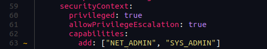

<div dir="rtl">

## مقدمه
در روزهای گذشته آسیب‌پذیری‌ **Log4Shell** (CVE-2021-44228, CVE-2021-45046) در صدر اخبار حوزه‌ی امنیت فناوری اطلاعات بوده است. بسیاری از شرکت‌ها برای شناسایی و رفع این آسیب‌پذیری دچار چالش شده بودند. برای شناسایی این آسیب‌پذیری ابزار‌ها و یک‌خطی‌های (*one-liners*) مختلفی در دسترس بوده است. ما در هم‌روش برای شناسایی و کمک به مشتریانی که آسیب‌پذیر بوده‌اند از ابزار **Trivy** استفاده کردیم. در کلاستر‌های هم‌روش به صورت مداوم در بازه‌های زمانی معین کانتینر‌های در حال اجرا توسط Trivy پویش می‌شوند. در این مورد خاص به علت اهمیت این موضوع نتایج آسیب‌پذیری در اختیار مشتریان قرار گرفت. مزایای استفاده از Trivy به جای راه‌کارهای سنتی در بستر **کوبرنتیز** ما را ترغیب کرد که در یک نوشتار به معرفی Trivy و نحوه‌ی استفاده از آن در چرخه‌ی **CI/CD** در گیت‌لب بپردازیم.


## اهمیت اسکن کردن ایمیج‌ها در DevSecOps
یکی از گام‌های ساده در عین حال بسیار اثرگذار در بحث امن‌سازی سیستم‌ها، پویش (*scan*) آسیب‌پذیری‌های شناخته‌شده (*[known vulnerabilities](https://owasp.org/Top10/A06_2021-Vulnerable_and_Outdated_Components/)*) می‌باشد. بسیاری از اپ‌های کانتینری‌شده ممکن است بر پایه‌ی یک ایمیج قدیمی ایجاد شده باشند یا همچنین ممکن است در توسعه‌ی آنها از کتابخانه‌هایی استفاده شده باشد که دارای آسیب‌پذیری شناخته‌شده باشد. 

در یک برنامه‌ی کانتینری شده یک آسیب‌پذیری در سطح سیستم‌عامل می‌تواند امنیت کل برنامه را زیر سؤال ببرد. همچنین یکی از مواردی که اغلب توسط برنامه‌نویس‌ها نادیده گرفته می‌شود پویش آسیب‌پذیری کتابخانه‌های ثالث است که در توسعه‌ی برنامه مورد استفاده قرار می‌گیرد. به همین دلیل لازم است قبل از برپاسازی یک برنامه در محیط عملیاتی از جنبه‌ی امنیت و همچنین انطباق با سیاست‌های خاص (مثلاً برنامه‌های حوزه‌ی پرداخت‌ یا پزشکی) مورد پویش قرار بگیرد.  

در این شرایط با پویش پیوسته برنامه‌ها در زمان ساخت آن‌ها، در چرخه‌ی CI/CD، می‌توان در فاز ساخت ایمیج کانتینر بخشی از آسیب‌پذیری‌ها را شناسایی کرد و از انتشار نسخه‌ی ناامن و برپاسازی آن در محیط عملیاتی جلوگیری کرد. در این نوشتار برای پویش امنیتی ایمیج‌ها به معرفی ابزار Trivy و نحوه‌ی استفاده‌ی آن در چرخه‌ی CI/CD در GitLab می‌پردازیم.

## معرفی Trivy
**[Trivy](https://github.com/aquasecurity/trivy)** یک ابزار متن‌باز است که در ابتدا به عنوان یک پروژه‌ی شخصی برای رفع نیازمندی پویش امنیتی ایمیج کانتینرها در بستر کوبرنتیز توسعه داده شد. پس از انتشار نسخه‌های اولیه در کامیونیتی‌های متن‌باز به صورت گسترده مورد استقبال قرار گرفت. انتشار Trivy به صورت یک فایل باینری مستقل که وابستگی به هیچ پایگاه داده، کتابخانه و یا سیستم‌عامل خاصی ندارد باعث شده که استقرار و به‌کارگیری آن بسیار ساده و مطلوب شود.

Trivy توانایی شناسایی آسیب‌پذیری در سطح **ایمیج برنامه‌های کانتینری‌شده**، **فایل‌سیستم**، **مخزن مبتنی بر Git** و همچنین **فایل‌های تنظیمات (Configuration)** را داراست. به طور دقیق‌تر با استفاده از Trivy می‌توان آسیب‌پذیری‌هایی را که در سطح بسته‌های (*Package*) سیستم‌عامل یا کتابخانه‌های یک زبان برنامه‌نویسی وجود دارد شناسایی کرد.


پویشگر‌های امنیتی برای شناسایی آسیب‌پذیری‌ها نیاز دارند که نسخه‌ی بسته‌ها و کتابخانه‌های نصب‌شده را شناسایی کنند. سپس با استفاده از فهرستی از آسیب‌پذیری‌هایی که در اختیار دارند (مثلاً دیتابیس **[NVD](https://nvd.nist.gov/vuln)**, **[Red Hat](https://access.redhat.com/security/security-updates/cve)**) بسته‌ها و کتابخانه‌های آسیب‌پذیر را شناسایی و گزارش می‌کنند. برای مثال برای استخراج فهرست بسته‌های موجود در سیستم‌عامل‌ها می‌توانند از مسیرهای `/var/lib/dpkg/` یا `/lib/apk/db/` اطلاعات لازم را به‌دست بیاورند. در تصویر زیر یک نمونه از محتویات فایل `/var/lib/dpkg/status` نمایش داده شده است.

```bash
grep Package -A9 /var/lib/dpkg/status
```


اگر ایمیج یک کانتینر به جهت کاهش حجم ایمیج strip شده باشد و اطلاعاتی نظیر اطلاعات فوق از آن حذف شده باشد احتمالا Trivy و سایر پویشگر‌های مشابه در این فاز [نمی‌توانند به درستی عمل کنند]().

برای استخراج فهرست کتابخانه‌های استفاده شده نیز Trivy از فایل‌های معینی استفاده می‌کند. فهرست این فایل‌ها بر اساس زبان‌های برنامه‌نویسی در این لینک آورده شده است. برای مثال در پایتون فایل‌های Pipfile.lock, poetry.lock و requirements.txt در زمان پویش مخزن یا فایل‌سیستم مورد استفاده قرار می‌گیرد.

برای پویش امنیتی ایمیج کانتینر‌ها ابزارهای جایگزین دیگری نظیر [Clair](https://github.com/quay/clair), [Anchore](https://github.com/anchore) وجود دارد. در 
مقایسه‌هایی بین این ابزارها صورت گرفته است. غیر از ویژگی‌هایی که در صفحه‌ی معرفی پروژه در گیت‌هاب درج شده است، بر اساس تجربه‌ی ما ویژگی‌های زیر در Trivy قابل توجه است.

**- ساده بودن استقرار و بکارگیری**

**- سرعت بالا در اجرای پویش**

**- صحت عملکرد و میزان False/Positive کمتر نسبت به ابزارهای مشابه**

**- انطباق با فرآیند CI/CD**


## بررسی قابلیت‌های مهم Trivy


در این قسمت قابلیت‌های مهم Trivy نظیر پویش ایمیج کانتینر، پویش فایل سیستم و پویش تنظیمات ناامن در مانیفیست‌ها را با مثال‌ مرور می‌کنیم. شما هم می‌توانید با نصب کردن Trivy از طریق دستور زیر مثال‌های که در بخش بعدی آورده شده است را امتحان کنید. با اجرای دستور زیر نسخه‌ی ۰.۲۱.۲ بر روی سیستم‌عامل شما نصب خواهد شد.


```bash
curl -sfL https://raw.githubusercontent.com/aquasecurity/trivy/main/contrib/install.sh | sh -s -- -b /usr/local/bin v0.21.2
```

### پویش ایمیج کانتینر

همان‌طور که اشاره کردیم Trivy یک ابزار برای پویش آسیب‌پذیری‌های شناخته شده در ایمیج کانتینرها می‌باشد. برای پویش یک ایمیج می‌توانیم از دستور زیر استفاده کنیم.

```bash
$ trivy image hub.hamdocker.ir/library/httpd:2.4.43 | jq ".Results[].Vulnerabilities[].VulnerabilityID"

"CVE-2021-33574"
"CVE-2021-35942"
"CVE-2020-1751"
"quotCVE-2020-1752"
...
```

در مثال بالا فهرست آسیب‌پذیری‌های شناخته شده ایمیج httpd نسخه‌ی ۲.۴.۴۳ استخراج شده است. در زمان اجرا می‌توان از سوییچ‌های زیر برای فیلتر کردن پویش استفاده کرد.


### فیلتر کردن آسیب‌پذیری‌ها

 استفاده از ignore-unfixed برای نادیده گرفتن آسیب‌پذیری‌هایی که فاقد وصله هستند و تاکنون رفع نشده اند. 

```bash
$ trivy  image hub.hamdocker.ir/library/httpd:2.4.43 --ignore-unfixed
```

فیلتر کردن آسیب‌پذیری‌ها بر اساس شدت با استفاده از severity. 
مثلا:

```bash
$ trivy  image hub.hamdocker.ir/library/httpd:2.4.43 --severity HIGH,CRITICAL --ignore-unfixed
```

مشخص کردن یک فهرست برای نادیده گرفتن آسیب‌پذیری‌های خاص در زمان پویش
.
 برای اینکار باید در یک فایل به نام .trivyignore شناسه‌ی آسیب‌پذیری‌ها را وارد کنیم. مثلا:

```bash
$ cat .trivyignore
CVE-2021-33574
CVE-2021-35942
```
و سپس 
```
$ trivy  image hub.hamdocker.ir/library/httpd:2.4.43
```

در مثال بالا در زمان پویش، آسیب‌پذیری‌های CVE-2021-33574 و CVE-2021-35942 نادیده گرفته می‌شود. همچنین با استفاده از OPA می‌توانید فیلتر کردن آسیب‌پذیری‌ها را انجام دهد یا بر عکس مثال بالا، تعیین کنید که فقط یک آسیب‌پذیری خاص مثل log4shell در ایمیج‌ها بررسی شود.

### اختصاصی کردن فرمت خروجی  
فیلتر کردن نمایش و ذخیره کردن خروجی در یک فایل با استفاده از output و format

به صورت پیش‌فرض Trivy نتیجه‌ی آزمایش را در حالت جدول مانندی در خروجی نمایش می‌دهد. با استفاده از format , output می‌توانید فرمت خروجی را تغییر دهید. مثلا:


```bash
$ trivy  image hub.hamdocker.ir/library/httpd:2.4.43 --format json --output result.json
```
همچنین با استفاده از فرمت template می‌توانید فرمت خروجی اختصاصی خودتان را بسازید.

### پویش فایل سیستم

یکی دیگر از قابلیت‌های مهم Trivy امکان پویش فایل سیستم می‌باشد. با استفاده از این قابلیت می‌توان پکیج‌های مورد استفاده در یک پروژه (به جای کانتینر) را مورد پویش قرار داد. برای مثال در پروژه‌ی زیر نسخه‌های آسیب‌پذیر کتابخانه‌های پرکاربرد requests و pillow مورد استفاده قرار گرفته است.


با استفاده از دستور زیر پروژه مورد آزمایش قرار گرفته است. Trivy به صورت خودکار فایل requirements.txt را شناسایی و تجزیه می‌کند و سپس اقدام به شناسایی آسیب‌پذیری در پکیج‌ها می‌نماید. مسیر قرار گرفتن فایل requirements.txt و بقیه‌ی فایل‌های مشابه برای Trivy اهمیتی ندارد.


```bash
$ trivy fs /tmp/vulnerable_app
```


از همین ویژگی پویش فایل سیستم می‌توان برای اجرای عملیات پویش در زمان ساخت ایمیج یا در داخل یک کانتینر نیز استفاده کرد. برای مثال یک فایل requirements.txt و یک Dockerfile با محتویات زیر ایجاد کنید:

<div dir=ltr>requirements.txt</div>

```
requests==2.6.0
```

<div dir=ltr>Dockerfile</div>

```
FROM hub.hamdocker.ir/library/python:3.7-alpine3.11
COPY requirements.txt .
RUN apk add curl \
 && curl -sfL https://raw.githubusercontent.com/aquasecurity/trivy/master/contrib/install.sh | sh -s -- -b /usr/local/bin  && trivy fs --exit-code 1 --no-progress /
```

سپس با دستور زیر فرایند ساختن (build) ایمیج را فراخوانی کنید:


```bash
docker build -t test-fs .
```

بعد از اجرای دستور فوق فرایند ساختن ایمیج به علت وجود آسیب‌پذیری در بسته‌های سیستم‌عامل (نسخه‌ی قدیمی Alpine) و همین‌طور آسیب‌پذیری [CVE-2018-18074](https://nvd.nist.gov/vuln/detail/CVE-2018-18074) در کتابخانه‌ی requests با خطا خاتمه می‌باید. در تصاویر زیر این مورد نمایش داده شده است.


### پویش تنظیمات ناامن (Misconfiguration)

توانایی شناسایی misconfiguration در سطح فایل‌های تنظیمات (مانیفست‌های) مربوط به Docker, Kubernetes, Terrafrom و ... قابلیت بسیار مهمی دیگری است که در Trivy پیاده‌سازی شده است. با استفاده از conf می‌توان تنظیمات خطرناک در این فایل‌ها را شناسایی کرد. برای مثال در زیر مانیفست ساخت یک پاد در Kubernetes نشان داده شده است. در تعریف این پاد دو مورد ناامن استفاده شده است.



مورد اول استفاده از capability SYS_ADMIN و مورد دوم اجرای کانتینر در حالت privileged می‌باشد. با استفاده از conf در مسیر جاری که فایل تعریف پاد در آن قرار دارد را مورد آزمایش قرار می‌دهیم:

```bash
$ trivy conf --severity HIGH .
```


همان‌طور که در تصویر بالا مشاهده می‌کنید Trivy فایل‌های موجود در مسیر جاری را تجزیه کرده و نوع آن‌ها را نیز به درستی از نوع مانیفست‌های Kubernetes تشخیص داده و هر دو تنظیم ناامن را نیز شناسایی کرده است. در مسیری که برای پویش تعیین می‌کنیم اگر فایل‌های دیگری نیز وجود داشته باشد Trivy می‌تواند آنها را شناسایی و تحلیل کند. برای تسلط بیشتر بر این قابلیت پیشنهاد می‌کنم [مثال‌هایی](https://github.com/aquasecurity/trivy/tree/main/examples) که در مخزن پروژه آورده شده است را مطالعه کنید. همچنین برای آشنایی با سایر ویژگی‌ها نظیر حالت client/server و همچنین مطالعه‌ی دقیق‌تر راجع به آنها می‌توانید به آخرین نسخه‌ی مستندات پروژه Trivy در [اینجا](https://trivy.dev/latest/docs/) مراجعه کنید.


## استفاده از Trivy در فرایند CI/CD
در چرخه‌ی توسعه‌ی نرم‌افزار، اگر تست امنیت از گام‌های اولیه و به‌صورت مداوم انجام شود اثرگذاری بسیار زیادی خواهد داشت. برای خودکار کردن پویش ایمیج کانتینرها، در چرخه‌ی **CI/CD** و هنگام ساخت ایمیج‌ها، بررسی‌های لازم را انجام دهید و در صورت کشف آسیب‌پذیری از انتشار نسخه‌ی ناامن جلوگیری کنید.

در GitLab ، در فایل `.gitlab-ci.yml` یک فاز برای پویش آسیب‌پذیری‌ها تعریف کنید. نمونه زیر، پس از **build** و **push** ایمیج، در فاز **test** پویش را انجام می‌دهد:

```yaml
stages:
  - build
  - test

build:
  stage: build
  image: docker:stable
  script:
    - export IMAGE="registry.hamdocker.ir/GROUP_NAME/PROJECT_NAME"
    - docker login -u "$REGISTRY_USER" -p "$REGISTRY_PASSWORD" "$REGISTRY"
    - docker build -t PROJECT_NAME:$CI_COMMIT_SHORT_SHA .
    - docker image tag PROJECT_NAME:$CI_COMMIT_SHORT_SHA $IMAGE:$CI_COMMIT_SHORT_SHA
    - docker image push $IMAGE:$CI_COMMIT_SHORT_SHA

container_scanning:
  stage: test
  image:
    name: hub.hamdocker.ir/aquasec/trivy:latest
    entrypoint: [""]
  variables:
    GIT_STRATEGY: none
    TRIVY_USERNAME: "$REGISTRY_USER"
    TRIVY_PASSWORD: "$REGISTRY_PASSWORD"
    TRIVY_AUTH_URL: "$REGISTRY"
    FULL_IMAGE_NAME: registry.hamdocker.ir/GROUP_NAME/PROJECT_NAME:$CI_COMMIT_SHORT_SHA
  script:
    - trivy --version
    # پاکسازی کش ایمیج‌ها (پایگاه‌داده حذف نمی‌شود)
    - trivy image --clear-cache
    # به‌روزرسانی دیتابیس آسیب‌پذیری‌ها
    - trivy image --download-db-only --no-progress --cache-dir .trivycache/
    # تولید گزارش GitLab
    - trivy image --exit-code 0 --cache-dir .trivycache/ --no-progress \
        --format template --template "@/contrib/gitlab.tpl" \
        --output "gl-container-scanning-report.json" "$FULL_IMAGE_NAME"
    # شکست Job در صورت وجود CRITICAL
    - trivy image --exit-code 1 --cache-dir .trivycache/ --severity CRITICAL --no-progress "$FULL_IMAGE_NAME"
  cache:
    paths:
      - .trivycache/
  artifacts:
    when: always
    paths:
      - gl-container-scanning-report.json
    reports:
      container_scanning: gl-container-scanning-report.json
  only:
    refs:
      - master
```

برای استفاده از این مثال باید در قسمت variables در تعریف FULL_IMAGE_NAME نام گروه و نام پروژه را وارد کنید. مثلا به صورت زیر


```yaml
FULL_IMAGE_NAME: registry.hamdocker.ir/milad/myapp:$CI_COMMIT_SHORT_SHA
```

پس از اضافه کردن این فاز پس از هر commit در مخزن فرآیند build اجرا می‌شود و بعد از آن در فرآیند test عملیات پویش امنیتی ایمیج کانتینر صورت می‌گیرد. در این فاز بعد از آپدیت کردن دیتابیس Trivy پویش کامل ایمیج صورت می‌گیرد که نتیجه‌ی اجرای آن در فایل gl-container-scanning-report.json ذخیره می‌شود. در تصویر زیر مشاهده می‌کنیم که فرآیند پویش امنیتی به دلیل وجود آسیب‌پذیری با خطا خاتمه یافته است. در سمت راست در قسمت Job artifact می‌توانید گزارش پویش را دانلود و مشاهده کنید.


همچنین گزارش این پویش در بخش Security Dashboard > Vulnerability Report در دسترس می‌باشد. 


در تصویر بالا مشاهده می‌کنیم که آسیب‌پذیری‌های کشف شده در فرآیند CI/CD در قسمت Vulnerability Report آورده شده است که برای افراد دخیل در پروژه قابل پیگیری می‌باشد.

همان‌طور که اشاره شد با هربار commit کردن در مخزن این فرآیند اجرا خواهد شد و اگر پروژه دارای آسیب‌پذیری با درجه‌ی CRITICAL باشد، job فعلی با خطا خاتمه می‌یابد و فرآیند deploy صورت نخواهد گرفت.


## نتیجه‌گیری

در این نوشتار دیدیم که استفاده از ابزار Trivy ساده است و به راحتی می‌توان از آن در توسعه‌ی یک پروژه‌ و فرآیند CI/CD استفاده کرد. بروز بودن این ابزارها و قدرت‌شان در تشخیص پکیج‌ها و وابستگی‌ها در سطح سیستم‌عامل و زبان‌های برنامه‌نویسی بسیار قابل اتکاست، که با بهره‌گیری از آنها بخش زیادی از آسیب‌پذیری‌ها به سرعت در فاز توسعه کشف می‌شوند و از انتشار نسخه‌ی ناامن جلوگیری خواهد شد. در نظر داشته باشید که ممکن است حتی پس از انتشار یک نسخه نیز آسیب‌پذیری‌های در بسته‌ها و کتابخانه‌ها کشف شود. در این شرایط پیشنهاد می‌شود که با خودکار کردن فرآیند تست، به صورت پیوسته در زمان‌های معینی در طول روز همه‌ی کانتینر‌های در حال اجرا در کلاستر را از جنبه‌ی امنیت تست کنید.

</div>
